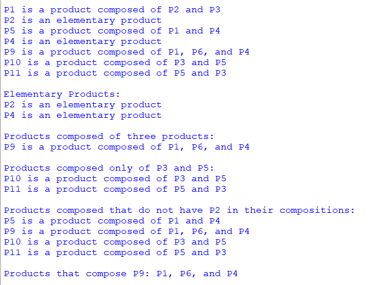

## Description
A Python demonstration illustrating the power of regular expressions (Regex) in analyzing and dissecting product compositions. Leveraging the findall function within Python's re module, this demo efficiently extracts and interprets information from text descriptions of product structures.
## Output

